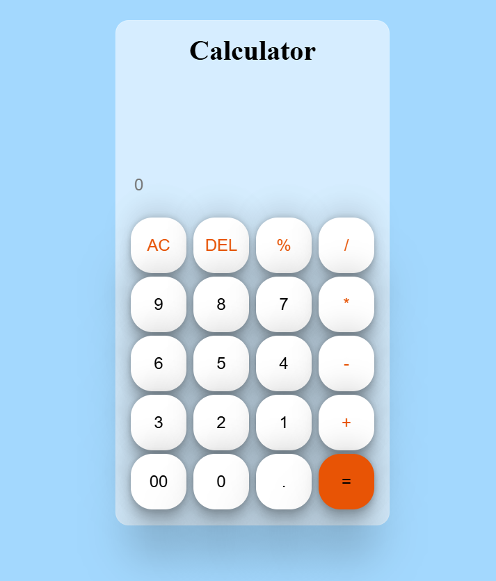

# 🔢 Simple Calculator

This is a basic calculator built with **HTML**, **CSS**, and **JavaScript**. It performs simple arithmetic operations like addition, subtraction, multiplication, and division. It also includes **AC (All Clear)** and **Del (Delete Last Entry)** functions.

---

## 📸 Screenshot

---

## 🚀 Features

- Add, Subtract, Multiply, Divide
- Decimal point support
- `=` to calculate
- `AC` to clear input
- `Del` to delete the last character
- Responsive design

---

## 💡 Technologies Used

- **HTML** – Structure
- **CSS** – Styling
- **JavaScript** – Functionality

---

